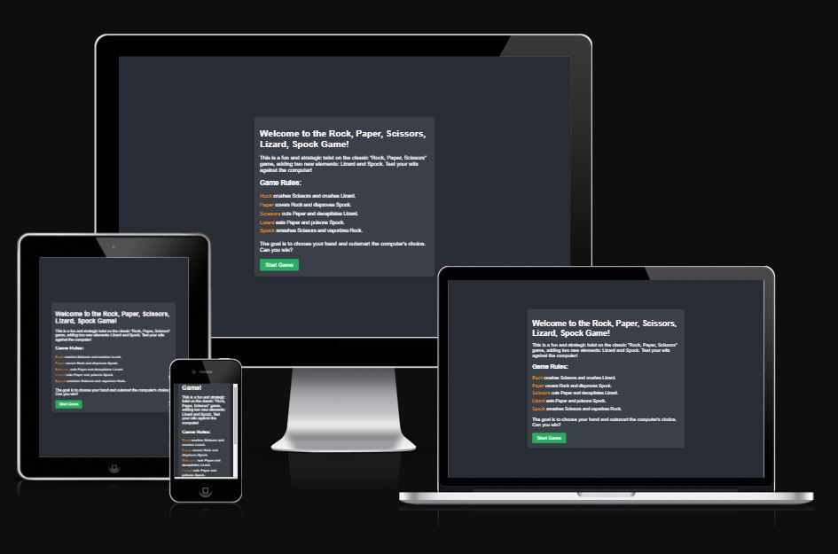
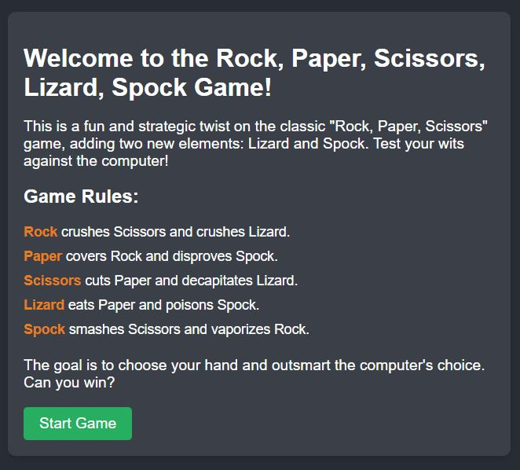
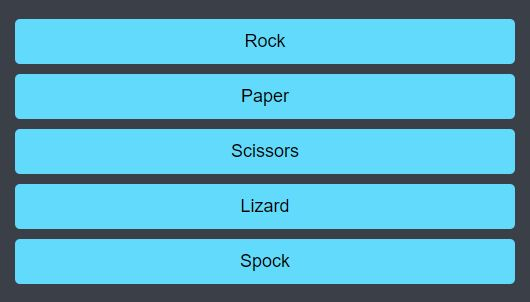
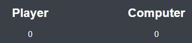

# Rock Paper Scissors Lizard Spock Game

The **Rock Paper Scissors Lizard Spock** game is a fun and engaging web-based application inspired by the classic game of Rock Paper and Scissors but with a twist. Adding Lizard and Spock, this game provides a more varied and strategic experience. The game is designed for players of all ages who enjoy interactive, competitive games. Where you're looking to play against the computer, this game provides a visually appealing and responsive experience across all devices.

## Feactures

The game has several key features aimed at providing an enjoyable user experience. Each feature is designed to be intuitive, visually appealing, and fully functional.

### Existing Features

- **Welcome Section and Game Rules**
    - The game starts with a friendly welcome message introducing players to the concept and mechanics of the game. Below the welcome message, the game rules are clearly explained to help new players understand how each choice interacts with the others. 
    
    

- **Game Interface**
    - The game interface consists of interactive buttons that allow players to select from five choices: Rock, Paper, Scissors, Lizard, and Spock. The choices are visually distinct and easy to click, making it accessible for desktop and mobile users.
    - After a choice is made, the game compares the player's selection with a randomly generated from the computer and displays the results.

    

- **Game logic Display**
    - Upon each game round, the outcome (win, lose, draw) is displayed to the user, along with the choices made by both the player and the computer. This ensures transparency and fairness in each game.

    

- **Score Tracking**
    - A score tracking features keeps count of the player's wins, losses, ties, making the game more competitive. Players can challenge themselves to improve their win rate against the computer.
    - The scores reset after a set number of rounds, allowing for short and repeatable game sessions.

    

- **Reset Function**
    - A reset button allows players to restart the game and reset the score counters back to zero without needing to refresh the page.

## Testing

The game has undergone extensive testing to ensure that all features work as expected. The primary focus was on ensuring the game logic produces accurate results and that the interface is easy to interact with. Here are some key areas Tested: 

- **Game Buttons**
    - Ensured each button click correctly registers the player's choice. 

- **Random Computer Selection**
    - The computer's random selection function has been thoroughly tested to ensure fairness in the game results.

- **Responsiveness**
    - Tested the design across various screen sizes including smartphones, tablets and desktop displays to ensure a consistent and visually pleasing user experience. 

- **Browser Compatibility**
    - The game has been tested across multiple browsers including Chrome, Firefox, Safari, and Edge to ensure compatibility. 

### Validator Testing

- **HTML**
    - No errors or warnings were found using the official [W3C HTML validator](https://validator.w3.org/)

- **CSS**
    - No issues were detected using the [W3C CSS validator](https://jigsaw.w3.org/css-validator/)

- **JavaScript**
    - The JavaScript code was validated using [JSHint](https://jshint.com/) and Returned no critical issues, ensuring clean and efficient code.

## Deployment

The game has been deployed using GitHub pages, making it easily accessible to users. To deploy this project yourself, follow these steps: 

    - Navigate to your repository's setting in GitHub. 
    - Under the "Pages" section, choose the branch and root folder from which to deploy. 
    - click "Save," and your site will be published automatically. 

You can access the live version of the game here: [Rock Paper Scissors Lizard Spock Game](https://lucyn03.github.io/rock-paper-scissors-lizard-spock-project/)

## Credits

### Content

- The game concept and rules are based n the extended version of Rock Paper Scissors
- Game logic and code were developed using JavaScript. 

### Media

- The images used for the icon are from [favicon.io](https://favicon.io/)
- All other visuals, including buttons and game layout mockup, were custom-designed for this project.

### Acknowledgements

- A special thanks to the [W3Schools](https://www.w3schools.com/) and [Code instiute](https://codeinstitute.net/ie/) for providing detailed documentation and tutorials on HTML, CSS, and JavaScript and thanks to my mentor to help with the planning of this project.